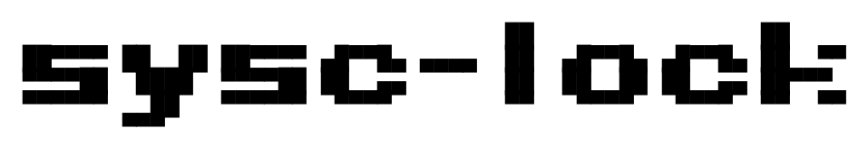
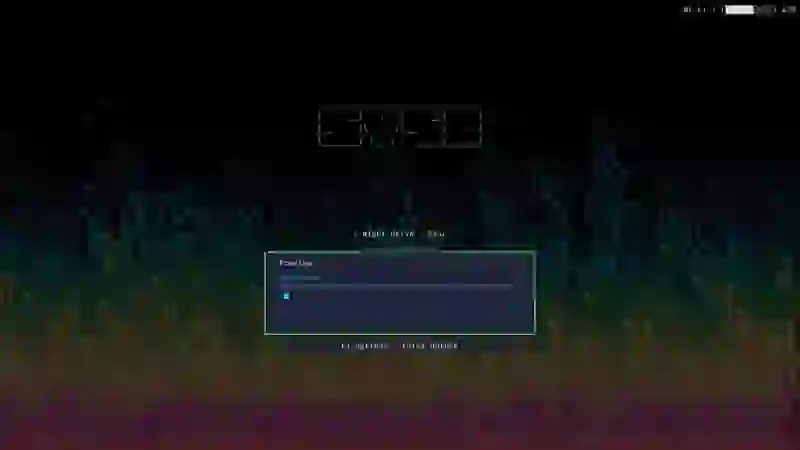
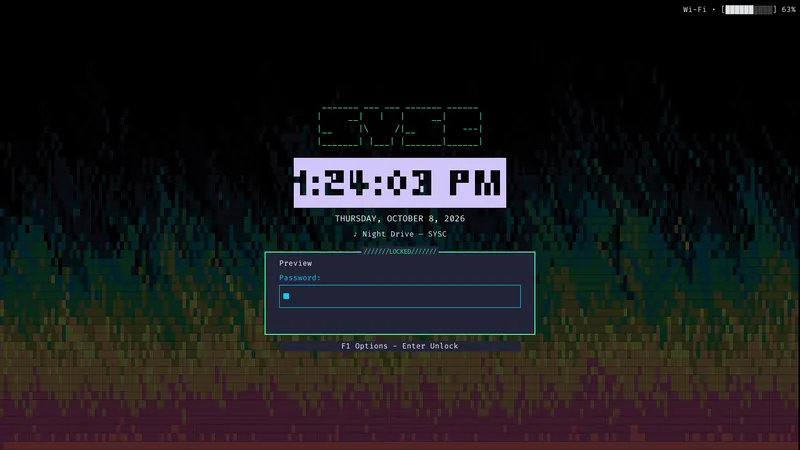
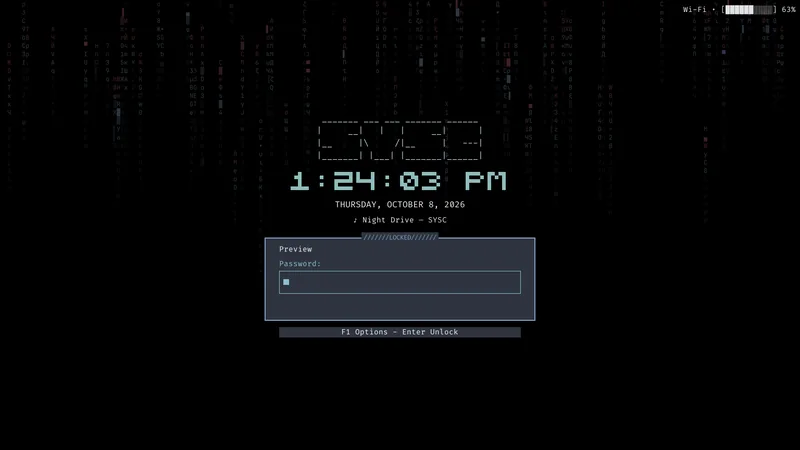
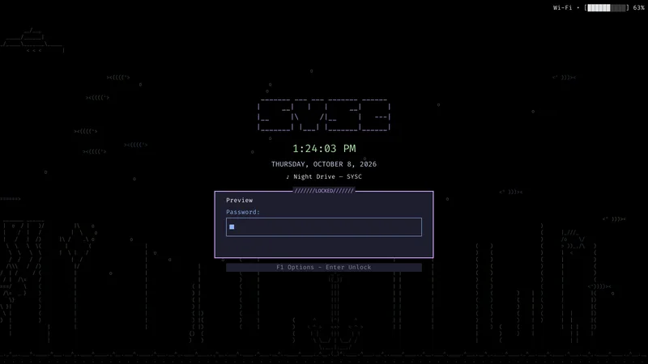
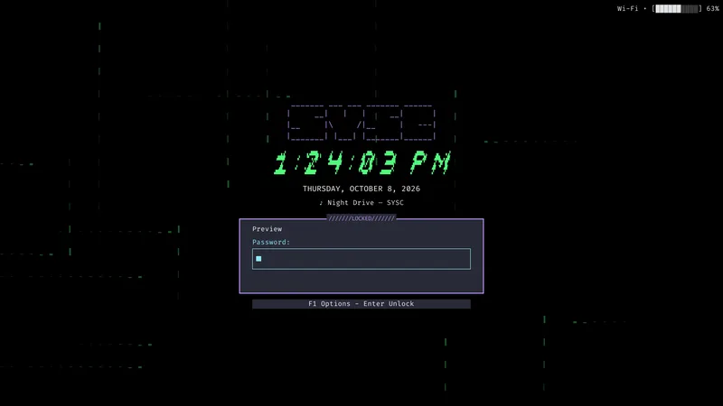
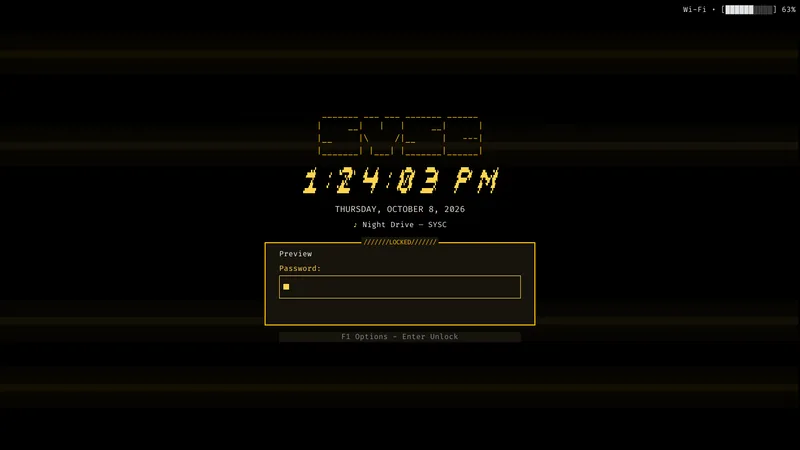
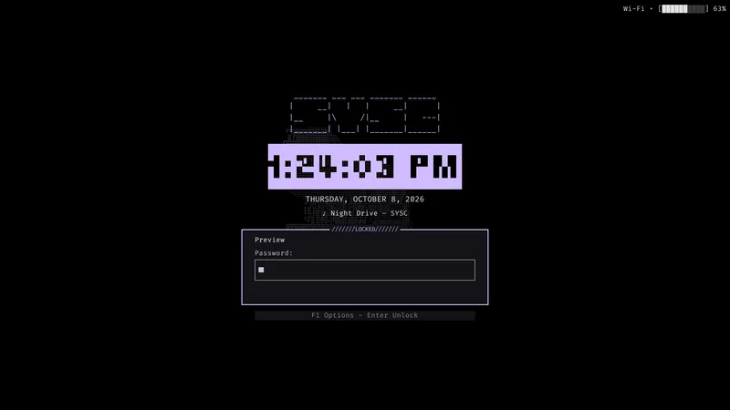
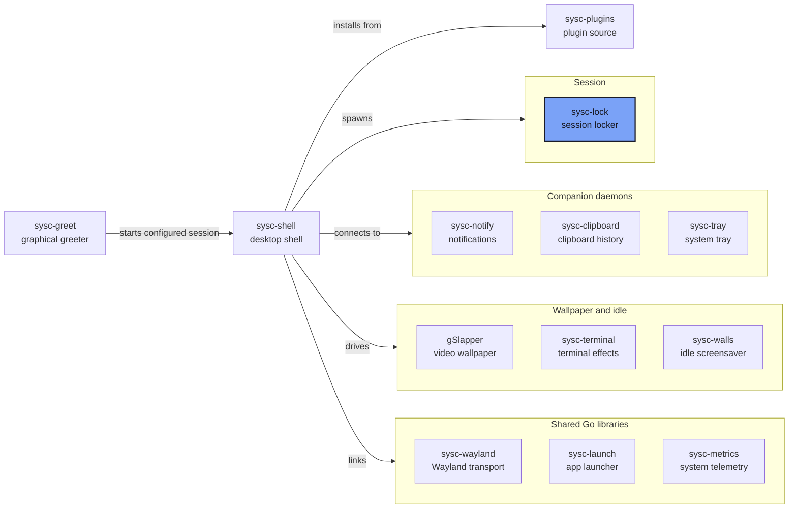

<p align="center">
  <picture>
    <source media="(prefers-color-scheme: dark)" srcset="assets/wordmark.png">
    
  </picture>
</p>


A Wayland session locker for sysc-shell, with compositor-enforced locking and in-process
PAM authentication. It supports Niri and sysc-shell.

<p align="center">
  <br>
  <sub>Four lock-screen themes, rendered by sysc-lock. <a href="assets/tour.mp4">Full-quality video</a></sub>
</p>

## Quick Links

- [Usage](#usage)
- [The sysc ecosystem](https://github.com/Nomadcxx/sysc-shell/blob/main/docs/ecosystem.md)

## Screenshots

Rendered with `sysc-lock --preview`, so no session was locked to capture them.

<table>
  <tr>
    <td align="center" valign="top"><br><sub>Fire, Eldritch</sub></td>
    <td align="center" valign="top"><br><sub>Matrix, Nord</sub></td>
  </tr>
  <tr>
    <td align="center" valign="top"><br><sub>Aquarium, Catppuccin Mocha</sub></td>
    <td align="center" valign="top"><br><sub>Beams, Dracula</sub></td>
  </tr>
  <tr>
    <td align="center" valign="top"><br><sub>Cracktro, Amber</sub></td>
    <td align="center" valign="top"><br><sub>Logo morph, Purple</sub></td>
  </tr>
</table>

## Security model

- Locking is the compositor's `ext-session-lock-v1` — not a layer-shell overlay.
  Input is sealed per-output; the session is never exposed by the locker dying.
- Authentication is PAM (`login` service) in-process. There is no bypass flag,
  no test-mode env var, and no IPC unlock path. Test fakes live only in `_test.go`.
- The entry is bounded to 4096 UTF-8 bytes. Mutable storage is wiped on deletion,
  clear and completion. Go strings and PAM/runtime copies cannot be reliably
  erased. Passwords do not enter logs or IPC. PAM conversations are answered
  one prompt at a time: hidden and visible prompts take their own fresh answer
  (never reused), TextInfo lines show sanitized in the hint strip, and error
  messages appear as status. Escape cancels the conversation and every answer
  has a 60s deadline; either leaves the session locked. Fingerprint unlocks
  work through the PAM stack (e.g. `auth sufficient pam_fprintd.so` above
  `unix_auth`) - sysc-lock never talks to fprintd directly.
- A persistent session owner holds a logind sleep delay before reporting readiness.
  It releases that descriptor on compositor confirmation for a sleep request,
  then re-arms on resume/unlock. logind's finite delay limit still applies.
  Failed protection is reported separately from manual locking.
- The session bus offers Lock, GetState and Changed only. It carries no secrets.
  Acquisition intent and confirmed-unlock receipts survive native service restart
  in a private runtime file. Disconnect never means authenticated unlock.

## Build

    go build ./cmd/sysc-lock

Requires libpam headers (`security/pam_appl.h`) because of the cgo PAM binding.

Linux amd64 release assets include `sysc-lock`, `sysc-lock-session.service`
and `SHA256SUMS`. The binary uses glibc (2.35 or newer), libpam, EGL and GLES
runtime libraries. The sysc suite installer verifies its pinned checksum,
installs the binary and enables the session service. Starting the service
does not acquire a lock; `sysc-lock` requests one.


## Install

The guided installer builds sysc-lock, installs the binary and the user unit, and
can undo both:

    go run ./cmd/installer

Offline, without cgo (the installer itself needs no cgo):

    CGO_ENABLED=0 go build -o sysc-lock-installer ./cmd/installer && ./sysc-lock-installer

One-liner:

    curl -fsSL https://raw.githubusercontent.com/Nomadcxx/sysc-lock/master/install.sh | sh -s -- --yes

The one-liner installs the newest release tag; run it as `... | SYSC_LOCK_REF=master sh -s -- --yes`
(any tag or branch works) to install something else.

Flags: `--prefix PATH` (default `$HOME/.local`; required when running as root),
`--candidate PATH` (install a prebuilt binary instead of building),
`--uninstall` (stop the service, remove the binary and unit), `--yes` (no prompts), `--log PATH`.
Exit codes: `0` complete, `1` a task failed, `2` usage or preflight refusal,
`130` cancelled.

Building sysc-lock needs the libpam headers, because that step runs with cgo
enabled; everything else, including `--uninstall`, does not.

The installer writes the binary and unit under the prefix, then activates
them: `systemctl --user enable` for `sysc-lock-session.service`, and a restart
when Niri is running so the new binary takes over. Outside Niri the service
starts with the next Niri session. With the default prefix the unit is on the
user manager's search path; any other prefix skips activation and says how to
link the unit. Last, if `~/.config/sysc-shell/config.json` names no locker,
it gains `"session": {"locker": "sysc-lock"}` and, unless `idle.lock` is set
or the sysc-walls screensaver is enabled, `"idle": {"lock": "5m0s"}`. A locker
you already chose is left alone. `--uninstall` stops and disables the service
before removing files. The installer never edits PAM and never uses sudo.
`scripts/install` still installs files only.

## Usage

    sysc-lock                    # requests the registered session owner and waits
    sysc-lock --session          # persistent owner, started by the user unit
    sysc-lock --ambient          # collector child; the owner starts it, not users
    sysc-lock --describe         # JSON presentation choices and defaults
    sysc-lock --version

While locked, the top-right corner shows network and battery, read from the
collector's snapshot file: `Wi-Fi • [██████░░░░] 63%`, with `charging`,
`full`, `plugged` or `LOW` (20% and under, discharging) spelled out, and
`Offline` when there is no default route. The corner stays on the idle
screen. A playing track appears under the date as `♪ Title — Artist`; a
paused one as `paused · Title`. Titles the lock font cannot draw give way to
the artist. On a discharging battery at 10% or less, the form's status row
says so whenever no error is showing. All of it is a read-only hint, never
an unlock path.

The service requires Niri's startup environment: XDG_SESSION_ID, NIRI_SOCKET,
WAYLAND_DISPLAY and XDG_RUNTIME_DIR. Registration verifies the real UID,
logind Wayland session and Niri IPC peer. One graphical Wayland session per UID
is supported. Conflicting or stale registration fails explicitly.

Presentation loads `$XDG_CONFIG_HOME/sysc-lock/config.json` at each acquisition:

```json
{"effect":"none","palette":"nord","reduced_motion":false,"clock_style":"kompaktblk","clock_24h":false,"effect_fps":20,"effect_backend":"auto","effect_gpu_power_save":true,"blur_backdrop":true,"blur_radius":24,"media":true,"idle_media":true,"power_actions":["logout","reboot","shutdown"]}
```

`effect` is optional: `none` (default) keeps the frozen blurred desktop and
skips the animation worker entirely; any of the scene effects (for example
`rain`, `fire`, `matrix`) animates behind the chrome instead. `palette` picks
the theme that drives both the chrome and the effect colors.

`clock_style` is `kompaktblk`, `phm_blocky_reverse`, `phmvga`, `phm_slanted`
or `plain`; an unknown
value uses `kompaktblk`. `effect_fps` is effect ticks per second (10–120); the
effects advance one fixed step per tick, so it also changes animation speed.
`effect_backend` picks who computes the frames: `cpu`, `gpu`, or `auto`
(default). The GPU backend renders the same effects with EGL and OpenGL ES 2
into the same shared-memory frames, so nothing on the wire changes; `auto`
tries the GPU once per lock and pins the CPU for that lock after any init
failure, draw error, or five consecutive frames slower than twice the frame
interval, noting the drop on stderr. `effect_gpu_power_save` (default true)
chooses the CPU outright while discharging and caps `effect_fps` at 30 for
`auto` on battery. GPU pixels never leave the process. Building lockd needs
EGL and GLES2 development headers; the linker flags are in the package.
Exporting GPU buffers to the compositor (dmabuf) is a later phase, not this.
F1 opens four options rows: Background, Theme, Header and Text effect.
Use ↑/↓ to select a row and ←/→ to change its value. PgUp/PgDown cycles
headers directly, even with F1 closed. Choices persist in config.json as
`header` (default `ascii_1`) and `text_effect` (default `none`). Header effects
use the shared sysc-greet effect library and pause during password entry or
authentication; reduced motion displays static artwork.

All ASCII headers live in **one file**, `~/.config/sysc-lock/headers.conf`
(or `$XDG_CONFIG_HOME/sysc-lock/headers.conf`). The first lock creates the
editable default collection without replacing an existing file. Add or edit
blocks in file order; spaces inside the triple quotes are literal:

```conf
ascii_custom="""
  /\_/\
 ( o.o )
  > ^ <
"""
```

Edits apply on the next lock. Each file supports up to 16 headers, each at most
120 columns and 16 lines, within 64 KiB. Missing or invalid artwork uses shipped
headers so customization cannot prevent locking. The header slot stays fixed
while cycling; compact outputs prioritize the password form.

The screen shows the clock until a key is pressed; that key only reveals the
password entry. The entry hides again after 8 seconds when empty, or on Esc.
After five minutes without input, the form gives way to the logo, banner,
clock and date. The first key returns to the prompt without entering or
submitting anything. Credentials, authentication and open menus keep the prompt
visible. Failed credential checks show a count and, from the third rejection,
an account-lockout warning; account-policy and infrastructure errors do not
increase that count.
Ctrl+V or Shift+Insert pastes the seat selection into the field when the
compositor offers `text/plain` (bounded to 4096 bytes); a compositor without a
data device stays keys-only. `power_actions` is the ordered Power Options menu; unknown names
and duplicates are dropped, and an empty list removes the menu and the
`F4 Power` hint. Names are `logout`, `reboot`, `shutdown`, `suspend` and
`hibernate`. `F4` opens the popup (a second `F4` resets to the first row;
`Esc` closes it), `↑↓` moves, and each action except Cancel needs Enter held
for a second and a half. An action logind will not permit is left out of the
menu, so it never offers a dead row. A refused call shows `Not permitted` and
typing works again.

Shell Settings → Lock Screen edits this file and provides a labeled ordinary
still preview rendered by the installed locker. Apply affects the next lock.
`sysc-lock --preview` reads a bounded JSON object from stdin and writes a PNG to
stdout, using sample identity and status. An optional `headers` string supplies
the same conf syntax for custom preview artwork; no user files are read. It does not lock, authenticate or write
configuration. For example:

```sh
printf '%s' '{"config":{"effect":"none","palette":"nord"},"width":960,"height":540}' | sysc-lock --preview > preview.png
```

The shared renderer comes from the pinned
sysc-terminal revision; wallpaper/invalid-effect failures use an opaque fallback.
`SYSC_LOCK_PALETTE` supplies the foreground palette. `SYSC_LOCK_WALLPAPER`
selects a static PNG/JPEG instead of the effect. The worker decodes it once per
acquisition and scales it when output geometry changes. Files above 16 MiB or
4 million pixels use the solid fallback; decoded assets share the pixel budget.
`blur_backdrop` (default true) grabs one picture of each output through
`zwlr_screencopy_manager_v1` before the lock takes the screen, downsamples and
box-blurs it once (`blur_radius`, 0-64, default 24) and freezes it as the
backdrop; effects never animate behind it. A compositor without screencopy, a
refused capture or `SYSC_LOCK_WALLPAPER` keeps the previous behaviour. Pixels
stay in memory and are wiped when the acquisition ends.

`media` (default true) shows the now-playing caption; `false` hides it
everywhere. `idle_media` (default true) keeps it on the idle screen; `false`
shows it on the lock form only. Track titles are visible to anyone at the
machine.

The owner resolves the PAM account once per acquisition from the real UID.

The CLI prints `sysc-lock: locked` on a sealed snapshot and returns success only
with a matching confirmed-unlock receipt. Refusal, lost ownership or transport
uncertainty returns failure. The service restarts on failure with a three-start
limit per minute; an exhausted recovery still leaves the compositor locked.

`scripts/install CANDIDATE ABSOLUTE_PREFIX` installs the executable and user unit.
The guided installer above runs these same steps.
It does not enable/start services or modify PAM. Review the candidate and recovery
route before activating the unit in a coordinated Niri session. The unit disables
core dumps. It permits the established PAM stack's native helper behavior.

Local checks cover state, input, PAM classification, marker recovery and sleep
ordering. Production Niri readmission, laptop PAM/lid/DPMS and physical hotplug
remain release gates in the sysc-shell implementation plan.

## Qualification evidence

Build the production candidate with PAM headers, then collect offline evidence:

```sh
CGO_ENABLED=1 go build -o /tmp/sysc-lock-candidate ./cmd/sysc-lock
scripts/qualify offline /tmp/sysc-lock-candidate /tmp/sysc-lock-evidence --ack-local-checks
```

For a coordinated live run, `scripts/qualify sample PID 600 EVIDENCE_DIR`
records CPU, RSS and descriptor counts for a recorded process owned by your UID.
Collect compositor events, commit cadence and input latency alongside these
samples. The script does not activate the service or perform locking/sleep.
The implementation plan lists the production PAM, recovery, sleep and output
gates; offline snapshots and local checks do not qualify them.

## Ecosystem



[The sysc ecosystem](https://github.com/Nomadcxx/sysc-shell/blob/main/docs/ecosystem.md) explains
each connection, socket and version pin.

## Documentation

- [The sysc ecosystem](https://github.com/Nomadcxx/sysc-shell/blob/main/docs/ecosystem.md)
- [sysc-shell](https://github.com/Nomadcxx/sysc-shell) — the shell that spawns and tracks the locker

---

<a href="https://github.com/Nomadcxx"></a> — terminal-native tooling for the linux desktop.
[More projects →](https://github.com/Nomadcxx) · [Sponsor](https://github.com/sponsors/Nomadcxx) ❤️

## Shell theme following

The locker follows the user's committed sysc-shell named theme at each lock. Sysc-shell publishes the selection to `$XDG_CONFIG_HOME/sysc-shell/shell-theme` (default `~/.config/sysc-shell/shell-theme`). Missing, invalid or unsupported selections preserve the configured palette.

Set `"follow_shell": false` in the locker config to keep an independent palette. Choosing a theme in the locker's options also disables following. Sysc-shell's Lock Screen settings provide a **Follow shell theme** switch. Generated and custom shell palettes retain the locker fallback until color transport supports them.
