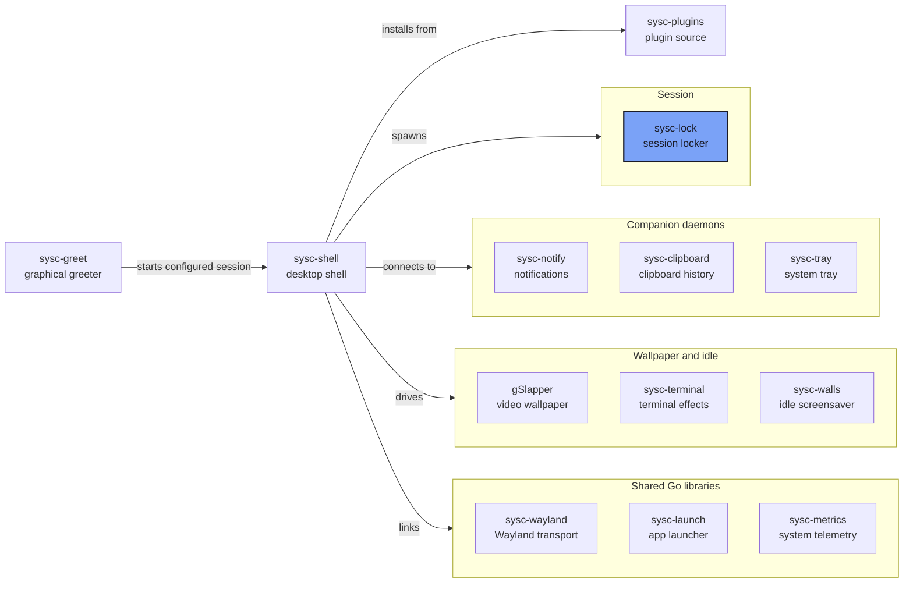

<p align="center"></p>

<p align="center"><strong>A session locker for Wayland, written in Go.</strong></p>

<p align="center">Locks the session with <code>ext-session-lock-v1</code> and authenticates with PAM. The compositor enforces the input seal; there is no IPC unlock and no bypass.</p>

## What it is

sysc-lock is the session locker behind [sysc-shell](https://github.com/Nomadcxx/sysc-shell). It
asks the compositor for a session lock, draws a lock screen on every output, and authenticates you
with PAM in-process. While locked, the compositor refuses input to every other client — that seal
is the security boundary, not the lock screen itself.

## How it fits together



[The sysc ecosystem](https://github.com/Nomadcxx/sysc-shell/blob/main/docs/ecosystem.md) explains
each connection, socket and version pin.

## Security model

- The compositor enforces the input seal through `ext-session-lock-v1`.
- Authentication is PAM's `login` service, in-process.
- No bypass, no test mode, no IPC unlock. Normal unlock requires successful PAM authentication and account management.
- Clearing password entry zeroes its current rune slice; backspaced runes outside that slice
  can remain in memory. After authentication, the code zeroes a temporary byte copy, not the
  immutable Go string passed to PAM. See `internal/input/model.go` and `internal/auth/auth.go`.
- Before requesting the lock, sysc-lock takes a logind sleep inhibitor. It releases the inhibitor
  after the locked handshake, or if locking fails or is cancelled before acquisition.

## Features

- `ext-session-lock-v1`; fails cleanly if the compositor doesn't expose it
- PAM `login` service, authenticate plus account management
- Wallpaper (PNG or JPEG, scale-to-cover) or a palette colour fallback
- Palette read from sysc-shell's `palette.json` (dark variant)
- Clock, `user@host`, masked entry, Caps Lock warning and failed-attempt counter
- Ordinary errors clear after four seconds; terminal PAM errors persist
- Exit codes and a stdout handshake that sysc-shell uses to track the lock

## Install

### Requirements

Go 1.26+, a C compiler with CGO enabled, and libpam headers (`security/pam_appl.h`).

### Build

```bash
git clone https://github.com/Nomadcxx/sysc-lock
cd sysc-lock
go build ./cmd/sysc-lock
```

## Usage

```bash
./sysc-lock
./sysc-lock --version
```

| Variable | Meaning |
|---|---|
| `SYSC_LOCK_PALETTE` | Palette path; defaults to `$XDG_CONFIG_HOME/sysc-shell/palette.json`, or `~/.config/sysc-shell/palette.json` when unset |
| `SYSC_LOCK_WALLPAPER` | PNG or JPEG wallpaper |
| `SYSC_LOCK_LAYOUT` | Display-only layout label; the real layout comes from the compositor keymap |

| Exit code | Meaning |
|---|---|
| 0 | Unlocked |
| 1 | Could not connect, lost the connection, or another error |
| 2 | Compositor refused the lock before acquisition |
| 3 | SIGTERM or SIGINT before the lock was up |
| 4 | No logind inhibitor available |
| 5 | The compositor terminated the lock |

When the lock is up and every output has drawn its first frame, sysc-lock prints `sysc-lock: locked`
to stdout. sysc-shell waits for that line, pauses wallpaper while the lock runs, and respawns the
locker once if it crashes after acquiring the lock. Install the binary on the shell service's PATH
before using this configuration:

```json
{ "session": { "locker": "sysc-lock" } }
```

## Development

```bash
go test -race ./...
```

## Documentation

- [The sysc ecosystem](https://github.com/Nomadcxx/sysc-shell/blob/main/docs/ecosystem.md)
- [sysc-shell](https://github.com/Nomadcxx/sysc-shell) — the shell that spawns and tracks the locker

---

<a href="https://github.com/Nomadcxx"></a> — terminal-native tooling for the linux desktop.
[More projects →](https://github.com/Nomadcxx) · [Sponsor](https://github.com/sponsors/Nomadcxx) ❤️
