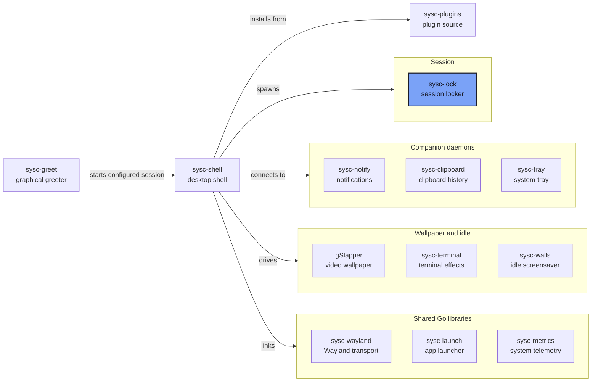

A Wayland session locker for sysc-shell, with compositor-enforced locking and in-process
PAM authentication. It supports Niri and sysc-shell.

## Quick Links

- [Usage](#usage)
- [The sysc ecosystem](https://github.com/Nomadcxx/sysc-shell/blob/main/docs/ecosystem.md)

## Security model

- Locking is the compositor's `ext-session-lock-v1` — not a layer-shell overlay.
  Input is sealed per-output; the session is never exposed by the locker dying.
- Authentication is PAM (`login` service) in-process. There is no bypass flag,
  no test-mode env var, and no IPC unlock path. Test fakes live only in `_test.go`.
- The entry is bounded to 4096 UTF-8 bytes. Mutable storage is wiped on deletion,
  clear and completion. Go strings and PAM/runtime copies cannot be reliably
  erased. Passwords do not enter logs or IPC. One hidden PAM prompt is supported;
  additional prompts fail without reusing the password.
- A persistent session owner holds a logind sleep delay before reporting readiness.
  It releases that descriptor on compositor confirmation for a sleep request,
  then re-arms on resume/unlock. logind's finite delay limit still applies.
  Failed protection is reported separately from manual locking.
- The session bus offers Lock, GetState and Changed only. It carries no secrets.
  Acquisition intent and confirmed-unlock receipts survive native service restart
  in a private runtime file. Disconnect never means authenticated unlock.

## Build

    go build ./cmd/sysc-lock

Requires libpam headers (`pam_apl.h`) because of the cgo PAM binding.

## Usage

    sysc-lock                    # requests the registered session owner and waits
    sysc-lock --session          # persistent owner, started by the user unit
    sysc-lock --ambient          # collector child; the owner starts it, not users
    sysc-lock --version

While the password entry is revealed, the owner may show one ambient row
(battery, link, playing, temperature) read from the collector's snapshot file;
it is a read-only hint, never an unlock path.

The service requires Niri's startup environment: XDG_SESSION_ID, NIRI_SOCKET,
WAYLAND_DISPLAY and XDG_RUNTIME_DIR. Registration verifies the real UID,
logind Wayland session and Niri IPC peer. One graphical Wayland session per UID
is supported. Conflicting or stale registration fails explicitly.

Presentation loads `$XDG_CONFIG_HOME/sysc-lock/config.json` at each acquisition:

```json
{"effect":"rain","palette":"nord","reduced_motion":false,"clock_style":"kompaktblk","clock_24h":false,"effect_fps":20,"power_actions":["logout","reboot","shutdown"]}
```

`clock_style` is `kompaktblk`, `phm_blocky_reverse` or `plain`; an unknown
value uses `kompaktblk`. `effect_fps` is effect ticks per second (10–120); the
effects advance one fixed step per tick, so it also changes animation speed.
The screen shows the clock until a key is pressed; that key only reveals the
password entry. The entry hides again after 8 seconds when empty, or on Esc.
Ctrl+V or Shift+Insert pastes the seat selection into the field (bounded to 4096 bytes) when
the compositor offers `text/plain`; a compositor without a data device stays
keys-only. `power_actions` is the ordered Power Options menu; unknown names
and duplicates are dropped, and an empty list removes the menu and the
`F4 Power` hint. Names are `logout`, `reboot`, `shutdown`, `suspend` and
`hibernate`. `F4` opens the popup (a second `F4` resets to the first row;
`Esc` closes it), `↑↓` moves, and each action except Cancel needs Enter held
for a second and a half. An action logind will not permit is left out of the
menu, so it never offers a dead row. A refused call shows `Not permitted` and
typing works again.

Shell Settings → Lock Screen edits this file and provides a labeled ordinary
preview. Apply affects the next lock. The shared renderer comes from the pinned
sysc-terminal revision; wallpaper/invalid-effect failures use an opaque fallback.
`SYSC_LOCK_PALETTE` supplies the foreground palette. `SYSC_LOCK_WALLPAPER`
selects a static PNG/JPEG instead of the effect. The worker decodes it once per
acquisition and scales it when output geometry changes. Files above 16 MiB or
4 million pixels use the solid fallback; decoded assets share the pixel budget.
The owner resolves the PAM account once per acquisition from the real UID.

The CLI prints `sysc-lock: locked` on a sealed snapshot and returns success only
with a matching confirmed-unlock receipt. Refusal, lost ownership or transport
uncertainty returns failure. The service restarts on failure with a three-start
limit per minute; an exhausted recovery still leaves the compositor locked.

`scripts/install CANDIDATE ABSOLUTE_PREFIX` installs the executable and user unit.
It does not enable/start services or modify PAM. Review the candidate and recovery
route before activating the unit in a coordinated Niri session. The unit disables
core dumps. It permits the established PAM stack's native helper behavior.

Local checks cover state, input, PAM classification, marker recovery and sleep
ordering. Production Niri readmission, laptop PAM/lid/DPMS and physical hotplug
remain release gates in the sysc-shell implementation plan.

## Qualification evidence

Build the production candidate with PAM headers, then collect offline evidence:

```sh
CGO_ENABLED=1 go build -o /tmp/sysc-lock-candidate ./cmd/sysc-lock
scripts/qualify offline /tmp/sysc-lock-candidate /tmp/sysc-lock-evidence --ack-local-checks
```

For a coordinated live run, `scripts/qualify sample PID 600 EVIDENCE_DIR`
records CPU, RSS and descriptor counts for a recorded process owned by your UID.
Collect compositor events, commit cadence and input latency alongside these
samples. The script does not activate the service or perform locking/sleep.
The implementation plan lists the production PAM, recovery, sleep and output
gates; offline snapshots and local checks do not qualify them.

## Ecosystem



[The sysc ecosystem](https://github.com/Nomadcxx/sysc-shell/blob/main/docs/ecosystem.md) explains
each connection, socket and version pin.

## Documentation

- [The sysc ecosystem](https://github.com/Nomadcxx/sysc-shell/blob/main/docs/ecosystem.md)
- [sysc-shell](https://github.com/Nomadcxx/sysc-shell) — the shell that spawns and tracks the locker

---

<a href="https://github.com/Nomadcxx"></a> — terminal-native tooling for the linux desktop.
[More projects →](https://github.com/Nomadcxx) · [Sponsor](https://github.com/sponsors/Nomadcxx) ❤️
